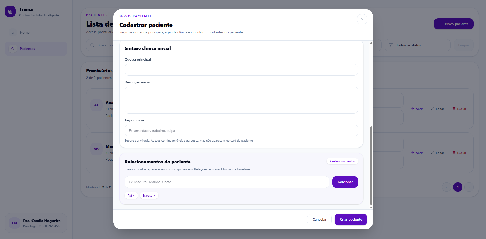
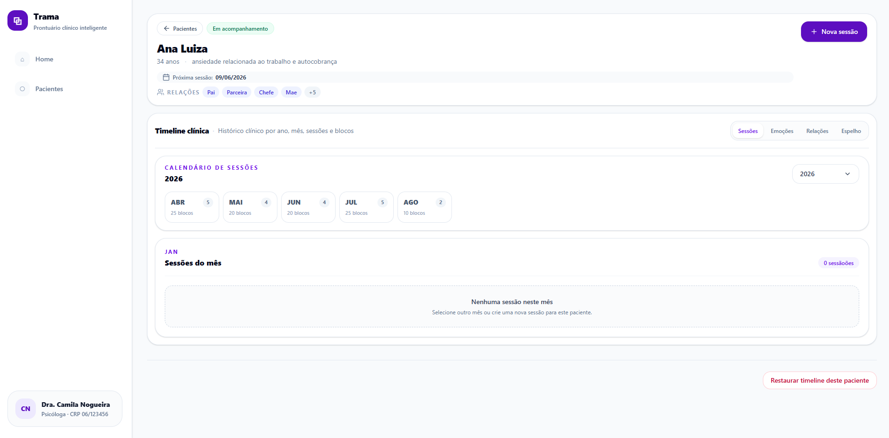
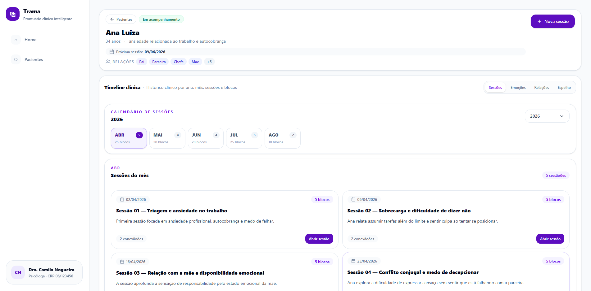
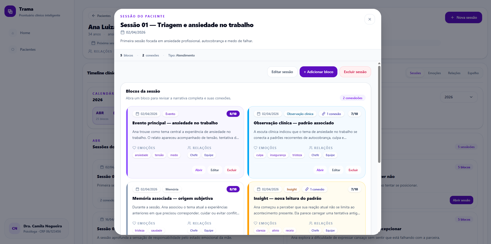
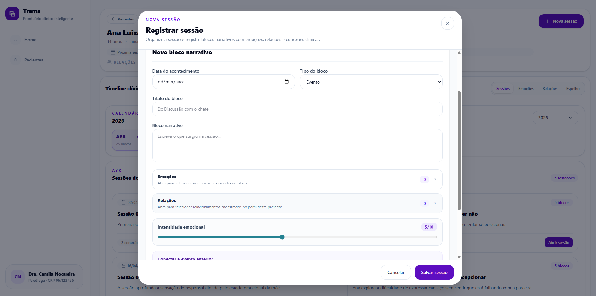
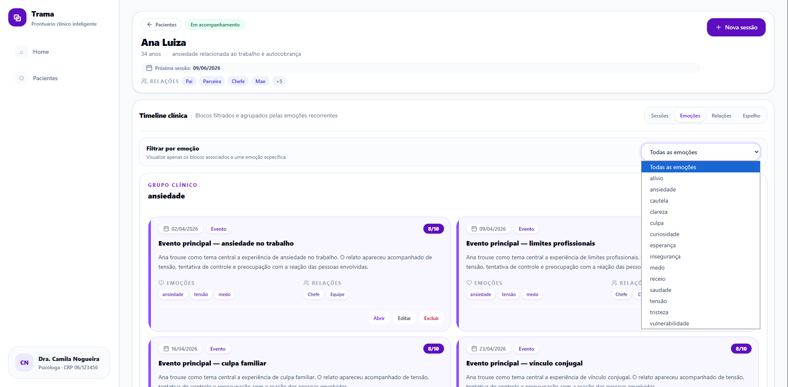
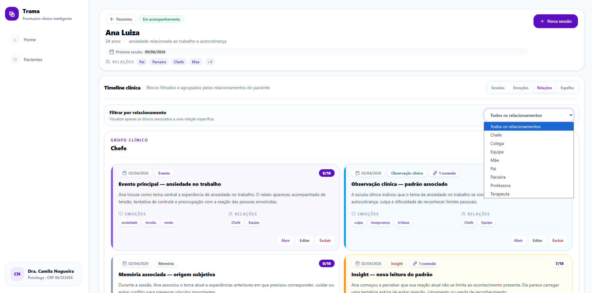
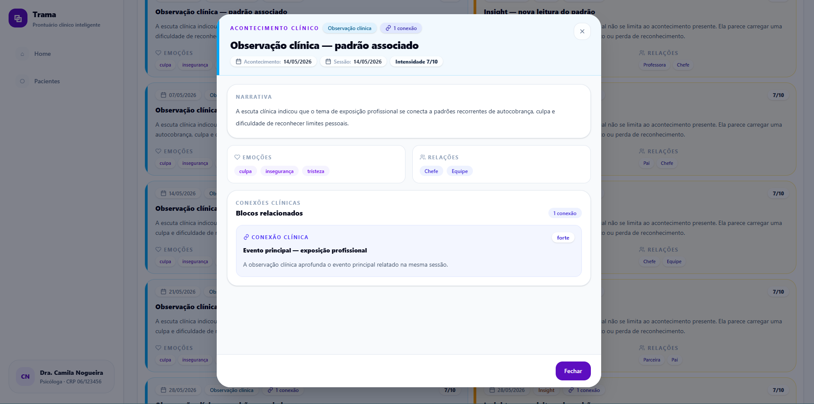
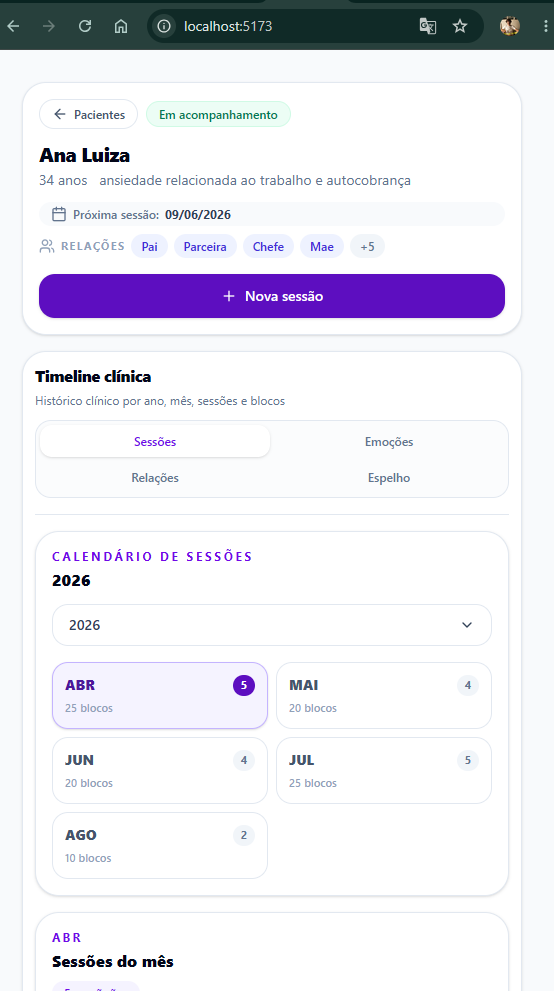

# Trama

**Trama** é um protótipo de sistema web para psicólogos acompanharem pacientes, sessões e acontecimentos clínicos de forma visual, cronológica e conectada.

A proposta do projeto é ir além de um prontuário tradicional, oferecendo uma forma mais clara de visualizar a trajetória emocional do paciente por meio de sessões, blocos narrativos, emoções, relações e conexões clínicas.

---

## Objetivo

O objetivo do Trama é ajudar psicólogos autônomos a organizar o acompanhamento clínico individual de seus pacientes.

O sistema permite:

- cadastrar e gerenciar pacientes;
- registrar sessões clínicas;
- dividir sessões em múltiplos blocos narrativos;
- associar emoções e relações aos acontecimentos;
- criar conexões entre blocos;
- visualizar a história do paciente por diferentes modos;
- manter uma timeline individual para cada paciente.

---

## Conceito principal

Cada paciente possui sua própria timeline clínica.

Essa timeline é formada por sessões. Cada sessão pode conter vários blocos de eventos, permitindo registrar diferentes acontecimentos, emoções, relações e observações clínicas em um único atendimento.

Exemplo:

```txt
Paciente: Ana Luiza
└─ Sessão do dia 10/03/2026
   ├─ Bloco 1: conflito com a mãe
   ├─ Bloco 2: ansiedade no trabalho
   ├─ Bloco 3: lembrança de abandono na infância
   └─ Bloco 4: insight sobre autocobrança
```

---

## Navegação atual

O menu lateral possui apenas:

```txt
Home
Pacientes
```

A timeline não é uma aba global. Ela é acessada ao abrir um paciente.

Fluxo principal:

```txt
Home
→ Pacientes
→ Abrir paciente
→ Timeline clínica individual
```

---

## Funcionalidades atuais

### Home

A Home é a tela inicial do profissional.

Ela foi revisada visualmente para ficar mais alinhada com a identidade atual do Trama.

A tela exibe:

- visão geral do profissional;
- indicadores pequenos:
  - pacientes;
  - em acompanhamento;
  - triagem inicial;
- bloco **Para acompanhar**:
  - retornos a definir;
  - primeira sessão pendente;
  - triagens em andamento;
- bloco **Atenção clínica**:
  - retornos sem data;
  - timelines ainda vazias;
- próximas sessões;
- pacientes recentes;
- acesso rápido à lista de pacientes.

A Home foi pensada para ser uma tela útil no início do trabalho, sem excesso de botões ou informações explicativas.

---

### Pacientes

A página de pacientes foi revisada visualmente para ficar mais alinhada com a Home, a Timeline e os modais responsivos.

A área de pacientes possui:

- topo visual refinado;
- botão **Novo paciente** em destaque;
- busca por nome, queixa, status ou descrição;
- filtro por status;
- limpeza rápida de filtros;
- listagem responsiva de pacientes;
- cadastro de novo paciente;
- edição de paciente;
- exclusão com confirmação;
- abertura do paciente ao clicar no card inteiro;
- ações internas de abrir, editar e excluir;
- estado vazio para lista sem resultados;
- resumo da timeline diretamente no card.

O card de paciente mostra:

- iniciais do paciente;
- nome;
- idade;
- queixa principal;
- descrição curta;
- status;
- quantidade de sessões;
- quantidade de blocos;
- quantidade de conexões clínicas;
- última sessão;
- próxima sessão;
- ações rápidas.

As tags continuam existindo nos dados e podem ser usadas na busca, mas não aparecem mais no card para manter a interface mais limpa.

---

### Relacionamentos do paciente

O cadastro do paciente possui uma área de **Relacionamentos do paciente**.

Nela, o profissional pode adicionar vínculos importantes, como:

```txt
Mãe
Pai
Marido
Chefe
Irmão
Colega
```

Esses relacionamentos são salvos no perfil do paciente e aparecem depois como opções no campo **Relações** ao criar ou editar blocos da timeline.

Isso faz com que cada paciente tenha suas próprias opções relacionais.

Exemplo:

```txt
Paciente Ana Luiza
Relacionamentos:
├─ Mãe
├─ Pai
├─ Marido
└─ Chefe

Ao criar um bloco para Ana:
Relações disponíveis:
├─ Mãe
├─ Pai
├─ Marido
└─ Chefe
```

Os relacionamentos são salvos com a primeira letra maiúscula e não são duplicados.

---

### Timeline individual por paciente

Cada paciente possui sua própria timeline salva separadamente no `localStorage`.

Exemplo:

```txt
Ana Luiza
└─ localStorage: trama_timeline_data_ana-luiza

João Luiz
└─ localStorage: trama_timeline_data_joao-luiz

Marcos Vieira
└─ localStorage: trama_timeline_data_marcos-vieira
```

Isso garante que:

- sessões de um paciente não apareçam em outro;
- blocos fiquem restritos ao prontuário correto;
- conexões clínicas não sejam compartilhadas entre pacientes;
- cada paciente tenha evolução própria.

---

### Sessões

A timeline permite:

- criar sessões;
- criar múltiplos blocos por sessão;
- adicionar blocos em sessão existente;
- editar sessões;
- excluir sessões;
- visualizar sessões em calendário anual;
- abrir sessão em modal;
- visualizar blocos padronizados dentro da sessão.

O calendário de sessões foi compactado e revisado para funcionar melhor em telas menores.

---

### Blocos clínicos

Cada bloco pode conter:

- título;
- texto narrativo;
- tipo de evento;
- data do acontecimento;
- data da sessão;
- emoções;
- relações;
- intensidade emocional;
- conexões com outros blocos.

Os blocos podem ser:

- criados;
- editados;
- excluídos;
- abertos em modal;
- conectados manualmente a outros blocos.

---

### ClinicalBlockCard

O projeto possui um componente padronizado para exibição dos blocos clínicos:

```txt
src/components/ClinicalBlockCard.jsx
```

Esse componente centraliza o visual dos blocos usados em:

```txt
Sessões
Emoções
Relações
Espelho
```

O card clínico exibe:

- cor por tipo de bloco;
- barra lateral colorida;
- data em destaque;
- tipo do bloco;
- título;
- resumo narrativo;
- intensidade emocional;
- emoções;
- relações;
- indicador de conexões;
- ações opcionais de abrir, editar e excluir.

Tipos de bloco e cores:

```txt
Evento              → violeta
Insight             → âmbar
Marco positivo      → verde
Evento traumático   → rosa
Observação clínica  → azul
```

Com isso, a interface fica mais consistente e qualquer ajuste visual nos blocos pode ser feito em um único componente.

---

## Modos de visualização da timeline

A timeline do paciente possui quatro modos:

```txt
Sessões | Emoções | Relações | Espelho
```

### Sessões

Organiza os registros pela data do atendimento clínico.

Permite:

- visualizar sessões por ano e mês;
- abrir uma sessão;
- ver os blocos daquela sessão;
- adicionar novo bloco à sessão;
- editar sessão;
- excluir sessão.

---

### Emoções

Agrupa os blocos pelas emoções associadas.

Possui filtro por emoção, permitindo visualizar apenas blocos ligados a uma emoção específica.

Exemplo:

```txt
Todas as emoções
Ansiedade
Culpa
Raiva
Tristeza
```

---

### Relações

Agrupa os blocos pelas relações envolvidas.

Possui filtro por relacionamento, permitindo visualizar apenas blocos ligados a uma relação específica.

Exemplo:

```txt
Todos os relacionamentos
Mãe
Pai
Marido
Chefe
```

As relações disponíveis vêm dos relacionamentos cadastrados no perfil do paciente e usados nos blocos.

---

### Espelho

O Espelho mostra a linha da vida emocional do paciente organizada pela data real dos acontecimentos, não apenas pela data em que foram relatados em sessão.

Ele possui:

- cabeçalho compacto;
- resumo em linha;
- filtro por ano;
- filtro por acontecimentos conectados;
- filtro por alta intensidade;
- agrupamento por ano;
- cards clínicos padronizados com `ClinicalBlockCard`.

Filtros atuais:

```txt
Todos os anos
Todos
Conectados
Alta intensidade
```

O objetivo do Espelho é ajudar o psicólogo a visualizar a história emocional do paciente de forma contínua e conectada.

---

### Modal de bloco

O `TimelineBlockModal` exibe a leitura completa de um acontecimento clínico.

Ele mostra:

- título;
- tipo;
- data do acontecimento;
- data da sessão;
- intensidade emocional;
- narrativa completa;
- emoções;
- relações;
- conexões clínicas;
- acesso a blocos conectados.

Esse modal é aberto a partir de sessões, emoções, relações e espelho.

---

### Estado vazio da timeline

Pacientes sem sessões possuem um estado vazio compacto, com orientação para criar a primeira sessão.

Isso evita que a tela pareça quebrada quando um paciente ainda não possui histórico clínico registrado.

---

## Descrição técnica

O Trama foi desenvolvido como um MVP front-end em React, com foco em componentização, organização de estado, persistência local e responsividade.

A aplicação utiliza Vite, JavaScript e Tailwind CSS. Os dados são persistidos no `localStorage`, com timelines individualizadas por paciente. A estrutura do projeto separa responsabilidades entre páginas, componentes, hooks, utils e dados demonstrativos.

Um dos pontos principais da arquitetura é o uso do componente `ClinicalBlockCard`, responsável por padronizar a exibição dos blocos clínicos nos modos Sessões, Emoções, Relações e Espelho.

As regras de agrupamento, resumo e mutação da timeline foram separadas em arquivos utilitários para manter os componentes mais limpos e reutilizáveis.

O projeto também inclui modais responsivos, CRUD local de pacientes, criação de sessões com múltiplos blocos, conexões clínicas entre acontecimentos e diferentes modos de visualização da timeline.

---

## Capturas do projeto

### Home


### Página de pacientes


### Cadastro de paciente e relacionamentos



### Prontuário do paciente



### Timeline em modo Sessões



### Modal de sessão com blocos clínicos



### Criação de sessão e bloco clínico



### Timeline em modo Emoções



### Timeline em modo Relações



### Espelho do paciente


### Modal de bloco clínico



### Responsividade mobile



---

## Responsividade

A responsividade principal do prontuário foi revisada nos componentes mais importantes da timeline.

Foram ajustados:

```txt
ClinicalBlockCard
PatientHeader
MirrorTimeline
SessionsCalendar
Timeline
```

Melhorias aplicadas:

- cards clínicos mais seguros em mobile;
- chips de emoções e relações com quebra controlada;
- cabeçalho do paciente com melhor adaptação em telas menores;
- botão **Nova sessão** em largura total no mobile;
- filtros do Espelho reorganizados;
- calendário de sessões em grid responsivo;
- abas da timeline em grid 2x2 no mobile;
- containers com espaçamentos menores em telas pequenas.

---

## Responsividade dos modais

Os principais modais do fluxo clínico foram revisados para funcionar melhor em telas menores.

Modais revisados:

```txt
AddSessionModal
AddPatientModal
SessionModal
TimelineBlockModal
```

Melhorias aplicadas:

- abertura como painel quase em tela cheia no mobile;
- cabeçalhos mais compactos;
- rolagem interna segura;
- rodapés fixos;
- botões em largura total no mobile;
- campos com melhor quebra em telas pequenas;
- listas expansivas mais legíveis;
- conexões clínicas mais acessíveis;
- leitura completa do bloco preservada em telas menores.

---

## Responsividade e visual da lista de pacientes

A página de pacientes também passou por revisão visual e responsiva.

Componentes envolvidos:

```txt
PatientsPage
PatientCard
PatientsFilters
```

Melhorias aplicadas:

- topo alinhado ao padrão visual da Home;
- busca e filtro mais compactos;
- card inteiro clicável;
- ações internas preservadas;
- cards mais harmônicos com o restante do sistema;
- resumo da timeline mais discreto;
- datas de última e próxima sessão em blocos menores;
- estado vazio melhorado;
- layout seguro em mobile;
- lista mais limpa para uso como tela principal de prontuários.

---

## Dados demonstrativos

O projeto possui um arquivo central de seeds:

```txt
src/data/timelineSeeds.js
```

Atualmente, a paciente **Ana Luiza** possui uma timeline demonstrativa com:

- 20 sessões;
- 5 blocos por sessão;
- 100 blocos no total;
- 2 blocos conectados por sessão.

Pacientes sem seed começam com timeline vazia e podem receber sessões manualmente pela interface.

Para recarregar o seed da Ana durante desenvolvimento:

```js
localStorage.removeItem("trama_timeline_data_ana-luiza")
```

Depois, basta atualizar a página e abrir a paciente Ana Luiza novamente.

---

## Estrutura do projeto

```txt
src/
├─ components/
│  ├─ AddPatientModal.jsx
│  ├─ AddSessionModal.jsx
│  ├─ ClinicalBlockCard.jsx
│  ├─ ConfirmModal.jsx
│  ├─ GroupedBlocksView.jsx
│  ├─ MirrorTimeline.jsx
│  ├─ PatientCard.jsx
│  ├─ PatientHeader.jsx
│  ├─ PatientsFilters.jsx
│  ├─ SessionModal.jsx
│  ├─ SessionsCalendar.jsx
│  ├─ Sidebar.jsx
│  ├─ Timeline.jsx
│  ├─ TimelineBlockModal.jsx
│  └─ TimelineEmptyState.jsx
│
├─ data/
│  ├─ patient.js
│  ├─ patients.js
│  ├─ sessionOptions.js
│  ├─ timeline.js
│  └─ timelineSeeds.js
│
├─ hooks/
│  ├─ usePatientsData.js
│  └─ useTimelineData.js
│
├─ pages/
│  ├─ HomePage.jsx
│  ├─ PatientPage.jsx
│  └─ PatientsPage.jsx
│
├─ utils/
│  ├─ patientTimelineSummary.js
│  ├─ patientsUtils.js
│  ├─ timelineMutations.js
│  └─ timelineUtils.js
│
├─ App.jsx
└─ main.jsx
```

---

## Arquitetura

O projeto separa responsabilidades entre páginas, componentes, hooks, utils e dados demonstrativos.

```txt
App.jsx
→ controla navegação principal e paciente selecionado

Sidebar.jsx
→ renderiza menu lateral com Home e Pacientes

HomePage.jsx
→ mostra visão geral do profissional, pontos de atenção e acessos rápidos

PatientsPage.jsx
→ controla listagem, busca, filtros e modais de pacientes

PatientsFilters.jsx
→ renderiza busca, filtro por status e limpeza de filtros

PatientCard.jsx
→ renderiza o card responsivo do paciente

AddPatientModal.jsx
→ cria e edita pacientes, incluindo relacionamentos do paciente

usePatientsData.js
→ controla estado, persistência e mutações de pacientes

patientsUtils.js
→ centraliza busca, normalização e filtros

patientTimelineSummary.js
→ calcula resumo da timeline para exibir no card e na Home

PatientPage.jsx
→ renderiza o prontuário individual do paciente

PatientHeader.jsx
→ mostra informações compactas do paciente aberto

useTimelineData.js
→ controla timeline individual por paciente

Timeline.jsx
→ controla modos Sessões, Emoções, Relações e Espelho

SessionsCalendar.jsx
→ renderiza o calendário clínico compacto

GroupedBlocksView.jsx
→ renderiza agrupamentos por emoção e relação

ClinicalBlockCard.jsx
→ padroniza o visual dos blocos clínicos

MirrorTimeline.jsx
→ renderiza o Espelho do paciente

TimelineBlockModal.jsx
→ exibe a leitura completa de um bloco clínico

timelineUtils.js
→ lê, agrupa e calcula dados da timeline

timelineMutations.js
→ altera a estrutura da timeline

timelineSeeds.js
→ centraliza timelines demonstrativas opcionais
```

---

## Persistência

Atualmente, o projeto usa `localStorage`.

Dados persistidos:

- pacientes;
- relacionamentos do paciente;
- timelines individuais;
- sessões;
- blocos;
- conexões.

As timelines são salvas por paciente:

```txt
trama_timeline_data_ana-luiza
trama_timeline_data_joao-luiz
trama_timeline_data_marcos-vieira
```

Essa persistência é temporária para o MVP. Em uma versão real, a camada local deve ser substituída por backend, autenticação e banco de dados.

---

## Tecnologias

- React
- Vite
- JavaScript
- Tailwind CSS
- LocalStorage
- Git
- GitHub

---

## Como rodar o projeto

### 1. Instalar dependências

```bash
npm install
```

### 2. Rodar em desenvolvimento

```bash
npm run dev
```

### 3. Acessar no navegador

```txt
http://localhost:5173
```

---

## Estado atual do MVP

O projeto já possui:

- navegação com Home e Pacientes;
- Home com visão geral do profissional;
- Home visualmente refinada;
- página de pacientes refinada;
- filtros de pacientes;
- cards de paciente responsivos;
- bloco Para acompanhar;
- bloco Atenção clínica;
- próximas sessões;
- pacientes recentes;
- CRUD local de pacientes;
- relacionamentos cadastrados no perfil do paciente;
- busca e filtros de pacientes;
- lista de pacientes responsiva;
- abertura do paciente pelo card inteiro;
- timeline individual por paciente;
- estado vazio para pacientes sem sessões;
- criação de sessões;
- criação de múltiplos blocos por sessão;
- edição de sessões;
- edição de blocos;
- exclusão com confirmação;
- conexões entre blocos;
- modo Sessões;
- modo Emoções com filtro por emoção;
- modo Relações com filtro por relacionamento;
- modo Espelho com filtro por ano, conectados e alta intensidade;
- cards clínicos padronizados com `ClinicalBlockCard`;
- modal de bloco refinado;
- revisão responsiva dos principais componentes da timeline;
- revisão responsiva dos principais modais;
- seed demonstrativo para Ana Luiza;
- persistência local.

---

## Limpeza recente

Após a padronização dos blocos com `ClinicalBlockCard`, componentes antigos sem uso foram removidos:

```txt
src/components/TimelineBlock.jsx
src/components/PatientsStats.jsx
```

Essa limpeza reduz duplicação visual e mantém a estrutura do projeto mais simples.

---

## Próximos passos

### Curto prazo

- Fazer última rodada de teste visual do MVP.
- Revisar textos e microcopy do sistema.
- Melhorar fluxo de criação de relacionamentos dentro do paciente.
- Melhorar edição do paciente dentro do prontuário.
- Melhorar estados vazios dos modos Emoções, Relações e Espelho.
- Preparar roteiro de apresentação do projeto para portfólio.

### Médio prazo

- Criar prontuário individual mais completo.
- Criar painel de padrões emocionais.
- Criar trilhas emocionais.
- Criar trilhas relacionais.
- Criar visão geral de sessões.
- Criar relatórios clínicos.
- Adicionar autenticação.
- Integrar backend.

### Longo prazo

- Criar banco de dados.
- Implementar segurança e LGPD.
- Criar permissões por profissional.
- Criar exportação de relatórios.
- Criar backup seguro.
- Avaliar recursos com IA de apoio clínico, mantendo o psicólogo no controle.

---

## Observações sobre LGPD

Este projeto ainda é um protótipo local.

Antes de uso real com dados sensíveis, será necessário implementar:

- autenticação segura;
- criptografia;
- controle de acesso;
- política de privacidade;
- consentimento adequado;
- logs de acesso;
- backup seguro;
- regras claras de retenção e exclusão de dados.

Dados clínicos são altamente sensíveis e exigem cuidado técnico, ético e legal.

---

## Status

Projeto em desenvolvimento.

O foco atual é construir um MVP funcional, organizado e apresentável como projeto de portfólio.

---

## Autor

Desenvolvido por Felipe Holanda.