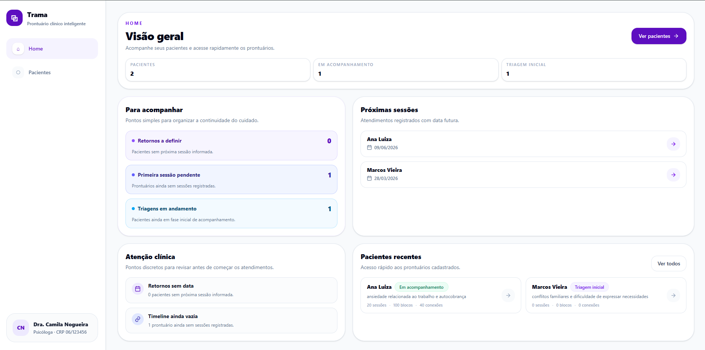
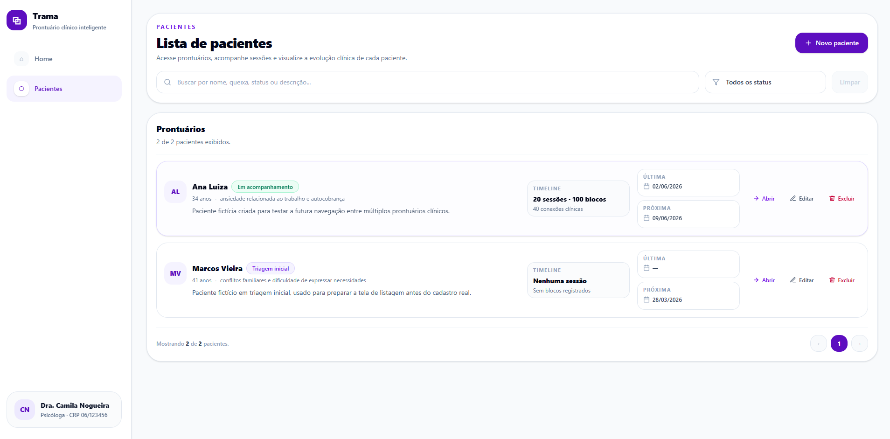
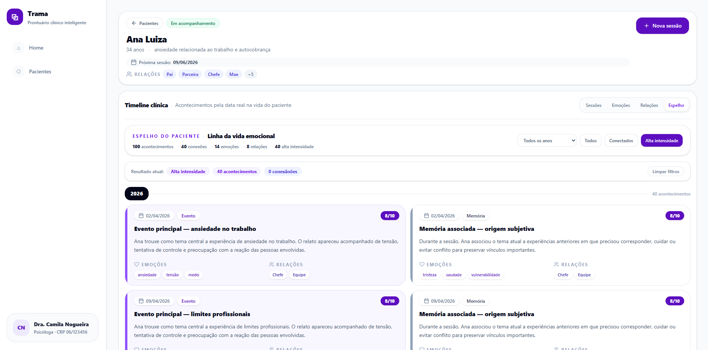

# Trama

**Trama** é um MVP web para psicólogos acompanharem pacientes, sessões e acontecimentos clínicos por meio de uma timeline visual, cronológica e conectada.

O projeto foi desenvolvido como portfólio front-end, com foco em **React**, **componentização**, **responsividade**, **organização de estado**, **persistência local** e construção de uma interface útil para um problema real.

---

## Preview

### Home



### Página de pacientes



### Espelho do paciente



---

## Problema

Psicólogos autônomos frequentemente registram sessões em anotações soltas, documentos lineares ou sistemas pouco visuais.

Isso pode dificultar a percepção de:

- padrões emocionais recorrentes;
- relações importantes na história do paciente;
- acontecimentos conectados ao longo do tempo;
- evolução clínica organizada por contexto, e não apenas por data da sessão.

---

## Solução

O Trama propõe uma forma mais visual de acompanhar a história clínica do paciente.

Cada paciente possui sua própria timeline, composta por sessões e blocos clínicos. Esses blocos podem conter narrativa, emoções, relações, intensidade emocional e conexões com outros acontecimentos.

Fluxo principal:

```txt
Home
→ Pacientes
→ Abrir paciente
→ Criar sessão
→ Registrar blocos clínicos
→ Visualizar por Sessões, Emoções, Relações ou Espelho
```

---

## Funcionalidades

- Cadastro, edição e exclusão de pacientes.
- Busca e filtro por status.
- Cadastro de relacionamentos por paciente.
- Timeline individual por paciente.
- Criação de sessões clínicas.
- Múltiplos blocos narrativos por sessão.
- Edição e exclusão de sessões e blocos.
- Conexões clínicas entre blocos.
- Visualização por Sessões, Emoções, Relações e Espelho.
- Filtro por emoção.
- Filtro por relacionamento.
- Filtro por ano no Espelho.
- Cards clínicos padronizados.
- Modais responsivos.
- Persistência local com `localStorage`.

---

## Diferencial: Espelho do Paciente

O **Espelho do Paciente** organiza os acontecimentos pela data real em que ocorreram na vida do paciente, e não apenas pela data em que foram relatados em sessão.

Essa visualização ajuda a observar a trajetória emocional de forma mais contínua, permitindo perceber conexões entre eventos, relações e padrões clínicos ao longo do tempo.

---

## Tecnologias

- React
- Vite
- JavaScript
- Tailwind CSS
- LocalStorage
- Git
- GitHub
- Vercel

---

## Arquitetura

O projeto separa responsabilidades entre páginas, componentes, hooks, utilitários e dados demonstrativos.

```txt
src/
├─ components/
│  ├─ AddPatientModal.jsx
│  ├─ AddSessionModal.jsx
│  ├─ ClinicalBlockCard.jsx
│  ├─ ConfirmModal.jsx
│  ├─ GroupedBlocksView.jsx
│  ├─ MirrorTimeline.jsx
│  ├─ PatientCard.jsx
│  ├─ PatientHeader.jsx
│  ├─ PatientsFilters.jsx
│  ├─ SessionModal.jsx
│  ├─ SessionsCalendar.jsx
│  ├─ Sidebar.jsx
│  ├─ Timeline.jsx
│  ├─ TimelineBlockModal.jsx
│  └─ TimelineEmptyState.jsx
│
├─ data/
│  ├─ patients.js
│  ├─ sessionOptions.js
│  └─ timelineSeeds.js
│
├─ hooks/
│  ├─ usePatientsData.js
│  └─ useTimelineData.js
│
├─ pages/
│  ├─ HomePage.jsx
│  ├─ PatientPage.jsx
│  └─ PatientsPage.jsx
│
├─ utils/
│  ├─ patientTimelineSummary.js
│  ├─ patientsUtils.js
│  ├─ timelineMutations.js
│  └─ timelineUtils.js
│
├─ App.jsx
└─ main.jsx
```

---

## Destaques técnicos

- Componentização com React.
- Separação de regras de negócio em `utils`.
- Persistência individualizada por paciente no `localStorage`.
- Hook dedicado para controle da timeline.
- Hook dedicado para controle de pacientes.
- Componente reutilizável `ClinicalBlockCard`.
- Interface responsiva com Tailwind CSS.
- Modais adaptados para desktop e mobile.
- Dados demonstrativos centralizados em seeds.
- Deploy em ambiente web com Vercel.

---

## Como rodar localmente

Clone o repositório:

```bash
git clone https://github.com/FelipeHolandaNovelino/trama-web.git
```

Acesse a pasta:

```bash
cd trama-web
```

Instale as dependências:

```bash
npm install
```

Rode o projeto:

```bash
npm run dev
```

Acesse no navegador:

```txt
http://localhost:5173
```

Para gerar o build de produção:

```bash
npm run build
```

---

## Persistência

O projeto usa `localStorage` para simular persistência de dados no MVP.

São persistidos:

- pacientes;
- relacionamentos do paciente;
- sessões;
- blocos clínicos;
- conexões;
- timelines individuais.

Em uma versão real, essa camada deve ser substituída por backend, autenticação e banco de dados.

---

## Observação sobre LGPD

Este projeto é um protótipo local e não deve ser usado com dados reais de pacientes.

Antes de qualquer uso real com dados sensíveis, seria necessário implementar autenticação, controle de acesso, criptografia, política de privacidade, consentimento adequado, logs de acesso e regras de retenção e exclusão de dados.

---

## Status

MVP front-end funcional, responsivo e publicado como projeto de portfólio.

Próximos passos possíveis:

- autenticação;
- backend;
- banco de dados;
- relatórios clínicos;
- exportação segura;
- painel de padrões emocionais.

---

## Autor

Desenvolvido por **Felipe Holanda**.